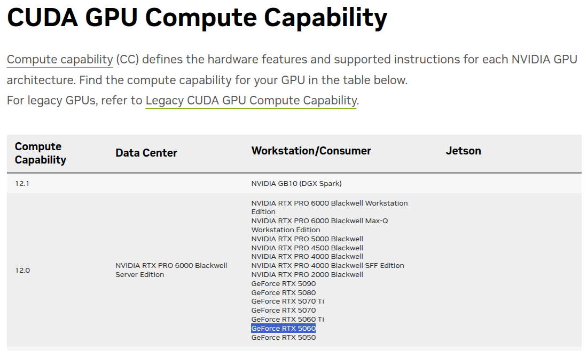
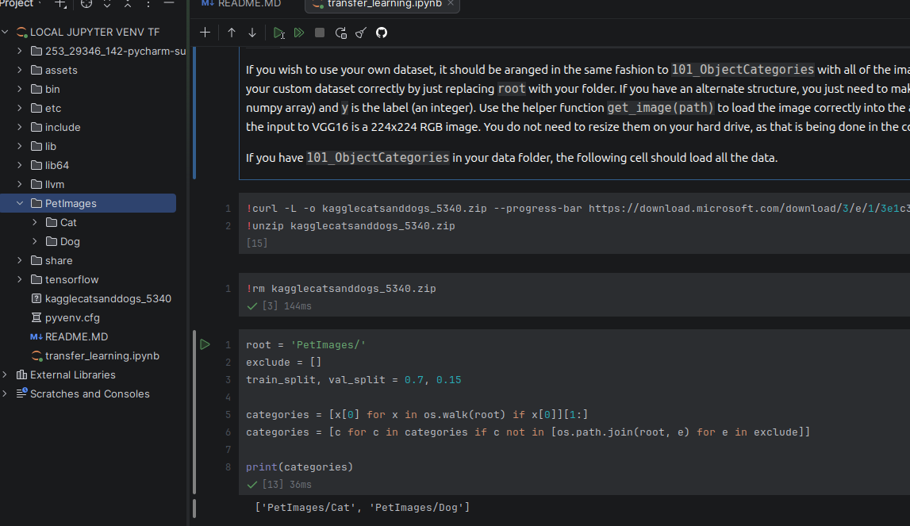
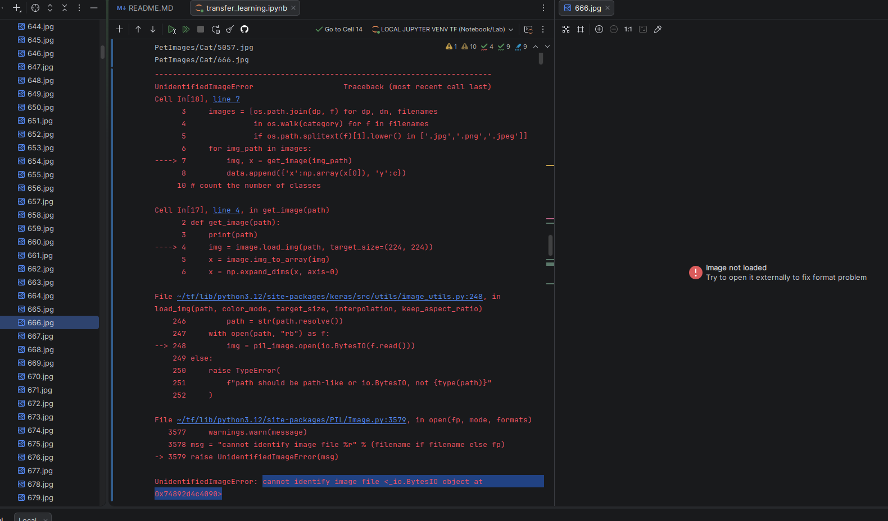
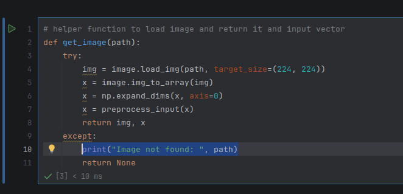

# Trabalho de Treinamento de Redes Neurais com Transfer Learning
### @autor: Alan Echer

## Configurações do ambiente

### Sistema Operacional Linux Mint 22.2 (Ubuntu based 24.04)
```shell
aecher@aecher-RYZEN:~$ lsb_release -a
No LSB modules are available.
Distributor ID:	Linuxmint
Description:	Linux Mint 22.2
Release:	22.2
Codename:	zara
```

### Placa Gráfica - NVIDIA GeForce RTX 5060
```shell
aecher@aecher-RYZEN:~$ nvidia-smi
Sun Jan  4 00:06:41 2026       
+-----------------------------------------------------------------------------------------+
| NVIDIA-SMI 590.44.01              Driver Version: 590.44.01      CUDA Version: 13.1     |
+-----------------------------------------+------------------------+----------------------+
| GPU  Name                 Persistence-M | Bus-Id          Disp.A | Volatile Uncorr. ECC |
| Fan  Temp   Perf          Pwr:Usage/Cap |           Memory-Usage | GPU-Util  Compute M. |
|                                         |                        |               MIG M. |
|=========================================+========================+======================|
|   0  NVIDIA GeForce RTX 5060        Off |   00000000:07:00.0  On |                  N/A |
|  0%   37C    P8              8W /  145W |    5989MiB /   8151MiB |      1%      Default |
|                                         |                        |                  N/A |
+-----------------------------------------+------------------------+----------------------+

+-----------------------------------------------------------------------------------------+
| Processes:                                                                              |
|  GPU   GI   CI              PID   Type   Process name                        GPU Memory |
|        ID   ID                                                               Usage      |
|=========================================================================================|
|    0   N/A  N/A            1113      G   /usr/lib/xorg/Xorg                      139MiB |
|    0   N/A  N/A            2053      G   cinnamon                                 68MiB |
|    0   N/A  N/A            2351      G   ...rack-uuid=3190708988185955192        130MiB |
|    0   N/A  N/A          265032      C   /home/aecher/tf/bin/python3            5552MiB |
|    0   N/A  N/A          269911      G   /usr/bin/gnome-system-monitor             7MiB |
|    0   N/A  N/A          270226      G   .../pycharm-2025.3.1/bin/pycharm          2MiB |
|    0   N/A  N/A          270393      G   .../log/jcef_chromium_270226.log         25MiB |
+-----------------------------------------------------------------------------------------+
```


A placa de video é da arquitetura blackwell e não funcionava nos bundles do tensorflow disponiveis, foi então que tive que realizar a compilação completa da lib do tensorflow com GPU CUDA especificamente para a minha placa de video e foi realmente um desafio pois precisei modificar vários pontos no projeto do tensorflow e também instalar várias ferramentas na minha máquina: 
- NVIDIA Geforce 590 Driver (o nativo disponibilizado para a distro do meu linux era a 580, porém consegui através do bundle do CUDA SDK instalar o mais recente 590)
- CUDA SDK 12.8.1 (somente a partir do 12.8.x temos o suporte a arquitetura sm_120 blackwell)
- CUDNN 9.8.0
- NVSHMEM 3.2.5
- CLANG LLVM-20.1.8-Linux-X64/bin/clang-20 (o nativo disponibilizado para a distro do meu linux era 18, tive que baixar e referenciar os paths no projeto do tensorflow)

### Versão do Python
```shell
(tf) aecher@aecher-RYZEN:~/tf$ python --version
Python 3.12.3
```

# Configurações utilizadas na compilação do tensorflow
### arquivo .tf_configure.bazelrc
```properties
build --action_env PYTHON_BIN_PATH="/usr/bin/python3"
build --action_env PYTHON_LIB_PATH="/usr/lib/python3.12/dist-packages"
build --python_path="/usr/bin/python3"
build:cuda --repo_env HERMETIC_CUDA_VERSION="12.8.1"
build:cuda --repo_env HERMETIC_CUDNN_VERSION="9.8.0"
build:cuda --repo_env HERMETIC_NVSHMEM_VERSION="3.2.5"
build:cuda --repo_env HERMETIC_CUDA_COMPUTE_CAPABILITIES="12.0"
build:cuda --repo_env HERMETIC_PYTHON_VERSION="3.12"
build --config=cuda_clang
build --action_env CLANG_CUDA_COMPILER_PATH="/home/aecher/tf/llvm/LLVM-20.1.8-Linux-X64/bin/clang-20"
build:opt --copt=-Wno-sign-compare
build:opt --copt -Wno-error=unused-command-line-argument
build:opt --copt -Wno-gnu-offsetof-extensions
build:opt --host_copt=-Wno-sign-compare
test --test_size_filters=small,medium
test --test_env=LD_LIBRARY_PATH
test:v1 --test_tag_filters=-benchmark-test,-no_oss,-oss_excluded,-no_gpu,-oss_serial
test:v1 --build_tag_filters=-benchmark-test,-no_oss,-oss_excluded,-no_gpu
test:v2 --test_tag_filters=-benchmark-test,-no_oss,-oss_excluded,-no_gpu,-oss_serial,-v1only
test:v2 --build_tag_filters=-benchmark-test,-no_oss,-oss_excluded,-no_gpu,-v1only
```

### modificacoes .bazelrc
```shell
(tf) aecher@aecher-RYZEN:~/tf/tensorflow$ git diff .bazelrc
diff --git a/.bazelrc b/.bazelrc
index 46f2ee94ae3..220f4e80245 100644
--- a/.bazelrc
+++ b/.bazelrc
@@ -309,7 +309,7 @@ build:cuda_clang --copt=-Qunused-arguments
+build:cuda_clang --repo_env=HERMETIC_CUDA_COMPUTE_CAPABILITIES="sm_60,sm_70,sm_80,sm_89,compute_90,compute_120"
@@ -321,7 +321,7 @@ build:cuda_clang --linkopt="-lm"
+build:cuda_clang_official --action_env=CLANG_CUDA_COMPILER_PATH="/home/aecher/tf/llvm/LLVM-20.1.8-Linux-X64/bin/clang"
@@ -363,7 +363,7 @@ build:rocm --define=xnn_enable_avx512fp16=false
+build:rocm_clang_official --action_env=CLANG_COMPILER_PATH="/home/aecher/tf/llvm/LLVM-20.1.8-Linux-X64/bin/clang"
@@ -602,7 +602,7 @@ build:rbe_linux_cpu --config=rbe_linux
+build:rbe_linux_cpu --repo_env=CC="/home/aecher/tf/llvm/LLVM-20.1.8-Linux-X64/bin/clang"
@@ -710,8 +710,8 @@ build:release_linux_base --linkopt=-Wl,--undefined-version
+build:release_linux_base --repo_env=CC="/home/aecher/tf/llvm/LLVM-20.1.8-Linux-X64/bin/clang"
+build:release_linux_base --repo_env=BAZEL_COMPILER="/home/aecher/tf/llvm/LLVM-20.1.8-Linux-X64/bin/clang"
(END)
```

### compilação bazel
```shell
bazel build //tensorflow/tools/pip_package:wheel --repo_env=USE_PYWRAP_RULES=1 --repo_env=WHEEL_NAME=tensorflow --config=linux --config=cuda_wheel --verbose_failures
```
### instalacao do artefato no venv tf
```shell
./pip install ../tensorflow/bazel-bin/tensorflow/tools/pip_package/wheel_house/tensorflow-2.20.0.dev0+selfbuilt-cp312-cp312-linux_x86_64.whl
```

### Enfim após configurar localmente o ambiente podemos começar nosso projeto
Após a leitura da primeira parte percebemos que precisamos modificar o script para baixar a nossa base de cats and dogs, faço então a modificação no script:
- fazemos um wget para baixar o arquivo zip: kagglecatsanddogs_5340.zip
- após o download faço a extração do conteúdo utilizando o comando unzip
- a pasta PetImages/Cat e PetImages/Dog é criada através da extração dos arquivos
- após a extração apago o arquivo zip
- faço também a modificação no script que identifica a pasta onde foi feita a extração e extrai delas as classes (deixando o array de exclusões vazio pois temos apenas as pastas corretas Cat e Dog)



O próximo passo é então carregar as imagens, ao executar encontro um problema com a imagem `666.jpg`, `11702.jpg` aparentemente esta corrompida e faço uma lógica para remove-las.



Faço então um try except para pegar quais imagens estão com problema e logar no console par exclui-las da pasta local.

