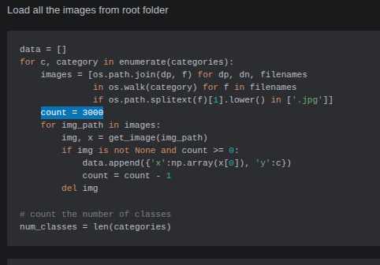
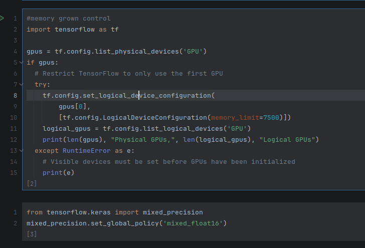
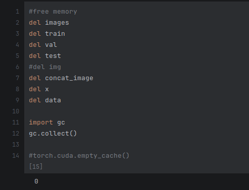
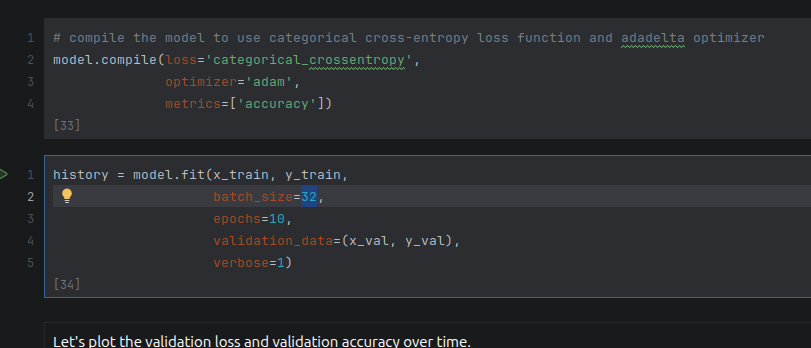
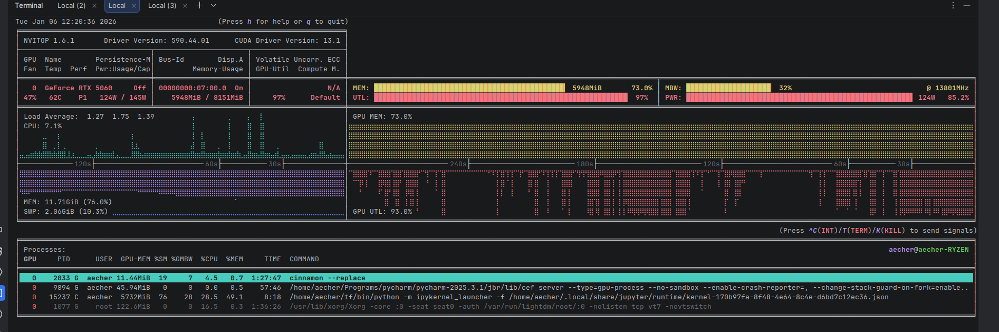
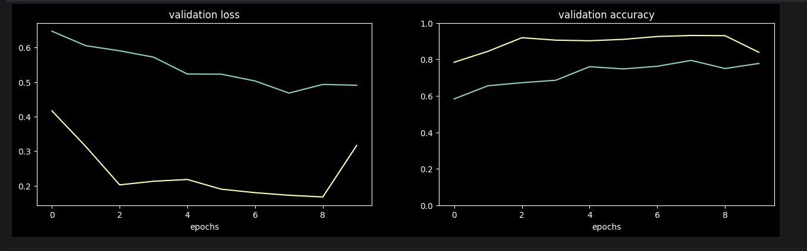
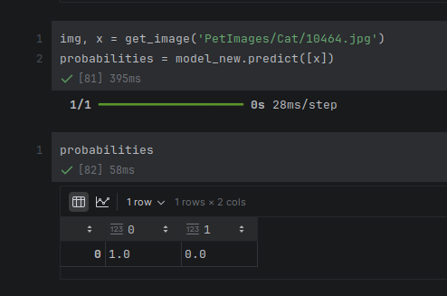
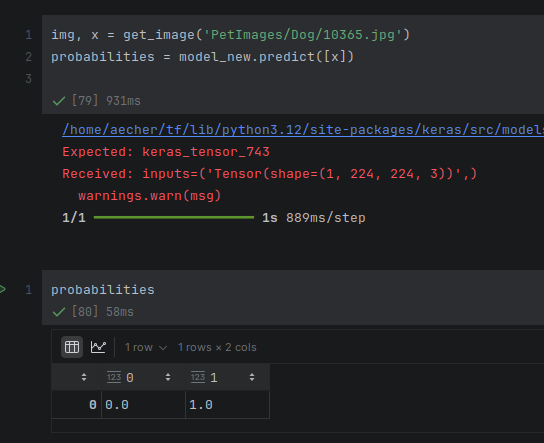
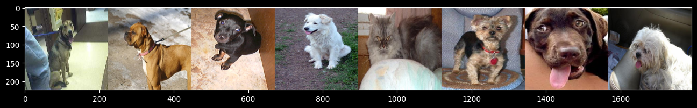
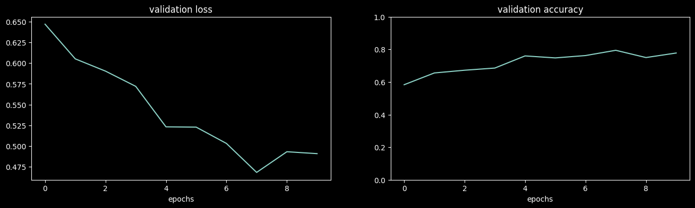

### Curso: DIO - Formação Machine Learning Specialist
### Trabalho: Treinamento de Redes Neurais com Transfer Learning
### Autor: Alan Echer

Para este trabalho tentei utilizar o ambiente do colab que não aguentou processar todas as informações assim como também o meu ambiente local não conseguiu, por isso foi necessário realizar algumas limitações na execução do algoritmo.

Sobre o conjunto de dados temos um dataset com imagens de gatos e cachorros, a pasta com imagens de gatos possui mais de 12 mil imagens, a pasta de cachorros possui mais de 12 mil imagens também, somando 24 mil amostras. 

O maior consumo de memória RAM está relacionado ao carregamento e conversão destas imagens em vetores para serem utilizadas no modelo, a amostra é muito grande para o hardware disponível, o colab possui pouco mais de 12GB de RAM e minha maquina possui 16GB, a opção de utilizar a maquina local foi utilizada para tentar mitigar os problemas de memória, foram realizadas tentativas de criação de memórias swap (100GB em disco de alta velocidade NVMe), consegui então fazer o carregamento completo das imagens, porém no momento de treinarmos o modelo, o algoritmo não conseguia alocar a memória RAM pois não havia disponível (possívelmente algum falso positivo pois havia swap disponível), enfim parti para outro caminho, realizar limitações na quantidade de imagens que seriam processadas, conseguindo obter o sucesso completo da execução de todo o notebook utilizando 3000 imagens. Foi necessário também reduzir o batch_size pois 128 era muito alto para ser processado, o valor ideal que funcionou para o hardware foi de 32.

Limitação na quantidade de imagens:



Otimizações de memória para uso de GPU / Redução no tamanho das variaveis de float32 para float16:



Otimizações de memória do algoritmo / garbage collector



Redução do Batch size:



## Configurações do ambiente

### Sistema Operacional Linux Mint 22.2 (Ubuntu based 24.04)
```shell
aecher@aecher-RYZEN:~$ lsb_release -a
No LSB modules are available.
Distributor ID:	Linuxmint
Description:	Linux Mint 22.2
Release:	22.2
Codename:	zara
```

### Placa Gráfica - NVIDIA GeForce RTX 5060
```shell
aecher@aecher-RYZEN:~$ nvidia-smi
Sun Jan  4 00:06:41 2026       
+-----------------------------------------------------------------------------------------+
| NVIDIA-SMI 590.44.01              Driver Version: 590.44.01      CUDA Version: 13.1     |
+-----------------------------------------+------------------------+----------------------+
| GPU  Name                 Persistence-M | Bus-Id          Disp.A | Volatile Uncorr. ECC |
| Fan  Temp   Perf          Pwr:Usage/Cap |           Memory-Usage | GPU-Util  Compute M. |
|                                         |                        |               MIG M. |
|=========================================+========================+======================|
|   0  NVIDIA GeForce RTX 5060        Off |   00000000:07:00.0  On |                  N/A |
|  0%   37C    P8              8W /  145W |    5989MiB /   8151MiB |      1%      Default |
|                                         |                        |                  N/A |
+-----------------------------------------+------------------------+----------------------+

+-----------------------------------------------------------------------------------------+
| Processes:                                                                              |
|  GPU   GI   CI              PID   Type   Process name                        GPU Memory |
|        ID   ID                                                               Usage      |
|=========================================================================================|
|    0   N/A  N/A            1113      G   /usr/lib/xorg/Xorg                      139MiB |
|    0   N/A  N/A            2053      G   cinnamon                                 68MiB |
|    0   N/A  N/A            2351      G   ...rack-uuid=3190708988185955192        130MiB |
|    0   N/A  N/A          265032      C   /home/aecher/tf/bin/python3            5552MiB |
|    0   N/A  N/A          269911      G   /usr/bin/gnome-system-monitor             7MiB |
|    0   N/A  N/A          270226      G   .../pycharm-2025.3.1/bin/pycharm          2MiB |
|    0   N/A  N/A          270393      G   .../log/jcef_chromium_270226.log         25MiB |
+-----------------------------------------------------------------------------------------+
```


A placa de video é da arquitetura blackwell e não funcionava nos bundles do tensorflow disponiveis, foi então que tive que realizar a compilação completa da lib do tensorflow com GPU CUDA especificamente para a minha placa de video e foi realmente um desafio pois precisei modificar vários pontos no projeto do tensorflow e também instalar várias ferramentas na minha máquina: 
- NVIDIA Geforce 590 Driver (o nativo disponibilizado para a distro do meu linux era a 580, porém consegui através do bundle do CUDA SDK instalar o mais recente 590)
- CUDA SDK 12.8.1 (somente a partir do 12.8.x temos o suporte a arquitetura sm_120 blackwell)
- CUDNN 9.8.0
- NVSHMEM 3.2.5
- CLANG LLVM-20.1.8-Linux-X64/bin/clang-20 (o nativo disponibilizado para a distro do meu linux era 18, tive que baixar e referenciar os paths no projeto do tensorflow)

### Versão do Python
```shell
(tf) aecher@aecher-RYZEN:~/tf$ python --version
Python 3.12.3
```

# Configurações utilizadas na compilação do tensorflow
### arquivo .tf_configure.bazelrc
```properties
build --action_env PYTHON_BIN_PATH="/usr/bin/python3"
build --action_env PYTHON_LIB_PATH="/usr/lib/python3.12/dist-packages"
build --python_path="/usr/bin/python3"
build:cuda --repo_env HERMETIC_CUDA_VERSION="12.8.1"
build:cuda --repo_env HERMETIC_CUDNN_VERSION="9.8.0"
build:cuda --repo_env HERMETIC_NVSHMEM_VERSION="3.2.5"
build:cuda --repo_env HERMETIC_CUDA_COMPUTE_CAPABILITIES="12.0"
build:cuda --repo_env HERMETIC_PYTHON_VERSION="3.12"
build --config=cuda_clang
build --action_env CLANG_CUDA_COMPILER_PATH="/home/aecher/tf/llvm/LLVM-20.1.8-Linux-X64/bin/clang-20"
build:opt --copt=-Wno-sign-compare
build:opt --copt -Wno-error=unused-command-line-argument
build:opt --copt -Wno-gnu-offsetof-extensions
build:opt --host_copt=-Wno-sign-compare
test --test_size_filters=small,medium
test --test_env=LD_LIBRARY_PATH
test:v1 --test_tag_filters=-benchmark-test,-no_oss,-oss_excluded,-no_gpu,-oss_serial
test:v1 --build_tag_filters=-benchmark-test,-no_oss,-oss_excluded,-no_gpu
test:v2 --test_tag_filters=-benchmark-test,-no_oss,-oss_excluded,-no_gpu,-oss_serial,-v1only
test:v2 --build_tag_filters=-benchmark-test,-no_oss,-oss_excluded,-no_gpu,-v1only
```

### modificacoes .bazelrc
```shell
(tf) aecher@aecher-RYZEN:~/tf/tensorflow$ git diff .bazelrc
diff --git a/.bazelrc b/.bazelrc
index 46f2ee94ae3..220f4e80245 100644
--- a/.bazelrc
+++ b/.bazelrc
@@ -309,7 +309,7 @@ build:cuda_clang --copt=-Qunused-arguments
+build:cuda_clang --repo_env=HERMETIC_CUDA_COMPUTE_CAPABILITIES="sm_60,sm_70,sm_80,sm_89,compute_90,compute_120"
@@ -321,7 +321,7 @@ build:cuda_clang --linkopt="-lm"
+build:cuda_clang_official --action_env=CLANG_CUDA_COMPILER_PATH="/home/aecher/tf/llvm/LLVM-20.1.8-Linux-X64/bin/clang"
@@ -363,7 +363,7 @@ build:rocm --define=xnn_enable_avx512fp16=false
+build:rocm_clang_official --action_env=CLANG_COMPILER_PATH="/home/aecher/tf/llvm/LLVM-20.1.8-Linux-X64/bin/clang"
@@ -602,7 +602,7 @@ build:rbe_linux_cpu --config=rbe_linux
+build:rbe_linux_cpu --repo_env=CC="/home/aecher/tf/llvm/LLVM-20.1.8-Linux-X64/bin/clang"
@@ -710,8 +710,8 @@ build:release_linux_base --linkopt=-Wl,--undefined-version
+build:release_linux_base --repo_env=CC="/home/aecher/tf/llvm/LLVM-20.1.8-Linux-X64/bin/clang"
+build:release_linux_base --repo_env=BAZEL_COMPILER="/home/aecher/tf/llvm/LLVM-20.1.8-Linux-X64/bin/clang"
(END)
```

### compilação bazel
```shell
bazel build //tensorflow/tools/pip_package:wheel --repo_env=USE_PYWRAP_RULES=1 --repo_env=WHEEL_NAME=tensorflow --config=linux --config=cuda_wheel --verbose_failures
```
### instalacao do artefato no venv tf
```shell
./pip install ../tensorflow/bazel-bin/tensorflow/tools/pip_package/wheel_house/tensorflow-2.20.0.dev0+selfbuilt-cp312-cp312-linux_x86_64.whl
```

### Uso de memória durante o treinamento (nvitop -m)



### Enfim após configurar localmente o ambiente podemos começar nosso projeto
Após a leitura da primeira parte percebemos que precisamos modificar o script para baixar a nossa base de cats and dogs, faço então a modificação no script:
- fazemos um wget para baixar o arquivo zip: kagglecatsanddogs_5340.zip
- após o download faço a extração do conteúdo utilizando o comando unzip
- a pasta PetImages/Cat e PetImages/Dog é criada através da extração dos arquivos
- após a extração apago o arquivo zip
- faço também a modificação no script que identifica a pasta onde foi feita a extração e extrai delas as classes (deixando o array de exclusões vazio pois temos apenas as pastas corretas Cat e Dog)


O próximo passo é então carregar as imagens, ao executar encontro um problema com a imagem `666.jpg`, `11702.jpg` aparentemente esta corrompida e faço uma lógica para remove-las.


Faço então um try except para pegar quais imagens estão com problema e ignora-las.


Após o treinamento do modelo podemos verificar o loss melhor em 8 epocas como mostra a figura abaixo:



Fiz uma validação com imagens novas, não utilizadas durante o treinamento, nem no teste e nem na validação e o resultado foi bem satisfatório para gato e para cachorro:





Abaixo pode ser verificado na integra a execução de todo o notebook:

# Transfer learning / fine-tuning

This tutorial will guide you through the process of using _transfer learning_ to learn an accurate image classifier from a relatively small number of training samples. Generally speaking, transfer learning refers to the process of leveraging the knowledge learned in one model for the training of another model.

More specifically, the process involves taking an existing neural network which was previously trained to good performance on a larger dataset, and using it as the basis for a new model which leverages that previous network's accuracy for a new task. This method has become popular in recent years to improve the performance of a neural net trained on a small dataset; the intuition is that the new dataset may be too small to train to good performance by itself, but we know that most neural nets trained to learn image features often learn similar features anyway, especially at early layers where they are more generic (edge detectors, blobs, and so on).

Transfer learning has been largely enabled by the open-sourcing of state-of-the-art models; for the top performing models in image classification tasks (like from [ILSVRC](http://www.image-net.org/challenges/LSVRC/)), it is common practice now to not only publish the architecture, but to release the trained weights of the model as well. This lets amateurs use these top image classifiers to boost the performance of their own task-specific models.

#### Feature extraction vs. fine-tuning

At one extreme, transfer learning can involve taking the pre-trained network and freezing the weights, and using one of its hidden layers (usually the last one) as a feature extractor, using those features as the input to a smaller neural net.

At the other extreme, we start with the pre-trained network, but we allow some of the weights (usually the last layer or last few layers) to be modified. Another name for this procedure is called "fine-tuning" because we are slightly adjusting the pre-trained net's weights to the new task. We usually train such a network with a lower learning rate, since we expect the features are already relatively good and do not need to be changed too much.

Sometimes, we do something in-between: Freeze just the early/generic layers, but fine-tune the later layers. Which strategy is best depends on the size of your dataset, the number of classes, and how much it resembles the dataset the previous model was trained on (and thus, whether it can benefit from the same learned feature extractors). A more detailed discussion of how to strategize can be found in [[1]](http://cs231n.github.io/transfer-learning/) [[2]](http://sebastianruder.com/transfer-learning/).

## Procedure

In this guide will go through the process of loading a state-of-the-art, 1000-class image classifier, [VGG16](https://arxiv.org/pdf/1409.1556.pdf) which [won the ImageNet challenge in 2014](http://www.robots.ox.ac.uk/~vgg/research/very_deep/), and using it as a fixed feature extractor to train a smaller custom classifier on our own images, although with very few code changes, you can try fine-tuning as well.

We will first load VGG16 and remove its final layer, the 1000-class softmax classification layer specific to ImageNet, and replace it with a new classification layer for the classes we are training over. We will then freeze all the weights in the network except the new ones connecting to the new classification layer, and then train the new classification layer over our new dataset.

We will also compare this method to training a small neural network from scratch on the new dataset, and as we shall see, it will dramatically improve our accuracy. We will do that part first.

As our test subject, we'll use a dataset consisting of around 6000 images belonging to 97 classes, and train an image classifier with around 80% accuracy on it. It's worth noting that this strategy scales well to image sets where you may have even just a couple hundred or less images. Its performance will be lesser from a small number of samples (depending on classes) as usual, but still impressive considering the usual constraints.


```python
#import resource

# The second value is the hard limit (unlimited here)
#soft_limit_bytes = 10 * 1024 * 1024 * 1024
#soft, hard = resource.getrlimit(resource.RLIMIT_AS)
#resource.setrlimit(resource.RLIMIT_AS, (soft_limit_bytes, hard))
```


```python
#memory grown control
#import tensorflow as tf

#gpus = tf.config.list_physical_devices('GPU')
#if gpus:
  # Restrict TensorFlow to only use the first GPU
  #try:
    #tf.config.set_logical_device_configuration(
    #    gpus[0],
    #    [tf.config.LogicalDeviceConfiguration(memory_limit=7500)])
    #logical_gpus = tf.config.list_logical_devices('GPU')
    #print(len(gpus), "Physical GPUs,", len(logical_gpus), "Logical GPUs")
  #except RuntimeError as e:
    # Visible devices must be set before GPUs have been initialized
   # print(e)
```


```python
from tensorflow.keras import mixed_precision
mixed_precision.set_global_policy('mixed_float16')
```

    2026-01-06 12:46:27.295419: I tensorflow/core/platform/cpu_feature_guard.cc:210] This TensorFlow binary is optimized to use available CPU instructions in performance-critical operations.
    To enable the following instructions: SSE3 SSE4.1 SSE4.2 AVX AVX2 FMA, in other operations, rebuild TensorFlow with the appropriate compiler flags.
    /home/aecher/tf/lib/python3.12/site-packages/keras/src/export/tf2onnx_lib.py:8: FutureWarning: In the future `np.object` will be defined as the corresponding NumPy scalar.
      if not hasattr(np, "object"):


```python
%matplotlib inline

import os

#if using Theano with GPU
#os.environ["KERAS_BACKEND"] = "tensorflow"

import random
import numpy as np
import keras

import matplotlib.pyplot as plt
from matplotlib.pyplot import imshow

from keras.preprocessing import image
from keras.applications.imagenet_utils import preprocess_input
from keras.models import Sequential
from keras.layers import Dense, Dropout, Flatten, Activation
from keras.layers import Conv2D, MaxPooling2D
from keras.models import Model
```

### Getting a dataset

The first step is going to be to load our data. As our example, we will be using the dataset [CalTech-101](http://www.vision.caltech.edu/Image_Datasets/Caltech101/), which contains around 9000 labeled images belonging to 101 object categories. However, we will exclude 5 of the categories which have the most images. This is in order to keep the class distribution fairly balanced (around 50-100) and constrained to a smaller number of images, around 6000.

To obtain this dataset, you can either run the download script `download.sh` in the `data` folder, or the following commands:

    wget http://www.vision.caltech.edu/Image_Datasets/Caltech101/101_ObjectCategories.tar.gz
    tar -xvzf 101_ObjectCategories.tar.gz

If you wish to use your own dataset, it should be aranged in the same fashion to `101_ObjectCategories` with all of the images organized into subfolders, one for each class. In this case, the following cell should load your custom dataset correctly by just replacing `root` with your folder. If you have an alternate structure, you just need to make sure that you load the list `data` where every element is a dict where `x` is the data (a 1-d numpy array) and `y` is the label (an integer). Use the helper function `get_image(path)` to load the image correctly into the array, and note also that the images are being resized to 224x224. This is necessary because the input to VGG16 is a 224x224 RGB image. You do not need to resize them on your hard drive, as that is being done in the code below.

If you have `101_ObjectCategories` in your data folder, the following cell should load all the data.


```python
import os
if os.path.isdir('PetImages'):
    print("already downloaded dataset... skipping")
else:
    !curl -L -o kagglecatsanddogs_5340.zip --progress-bar https://download.microsoft.com/download/3/e/1/3e1c3f21-ecdb-4869-8368-6deba77b919f/kagglecatsanddogs_5340.zip
    !unzip kagglecatsanddogs_5340.zip
    !rm kagglecatsanddogs_5340.zip
    !rm readme[1].txt
    !rm CDLA-Permissive-2.0.pdf
```

    already downloaded dataset... skipping


```python
root = 'PetImages/'
exclude = []
train_split, val_split = 0.7, 0.15

categories = [x[0] for x in os.walk(root) if x[0]][1:]
categories = [c for c in categories if c not in [os.path.join(root, e) for e in exclude]]

print(categories)
```

    ['PetImages/Cat', 'PetImages/Dog']


This function is useful for pre-processing the data into an image and input vector.


```python
# helper function to load image and return it and input vector
def get_image(path):
    try:
        img = image.load_img(path, target_size=(224, 224))
        x = image.img_to_array(img)
        x = np.expand_dims(x, axis=0)
        x = preprocess_input(x)
        return img, x
    except:
        print("Image not found: ", path)
        return None, None
```

Load all the images from root folder


```python
data = []
for c, category in enumerate(categories):
    images = [os.path.join(dp, f) for dp, dn, filenames
              in os.walk(category) for f in filenames
              if os.path.splitext(f)[1].lower() in ['.jpg']]
    count = 3000
    for img_path in images:
        img, x = get_image(img_path)
        if img is not None and count >= 0:
            data.append({'x':np.array(x[0]), 'y':c})
            count = count - 1
        del img

# count the number of classes
num_classes = len(categories)
```

    Image not found:  PetImages/Cat/666.jpg


    /home/aecher/tf/lib/python3.12/site-packages/PIL/TiffImagePlugin.py:949: UserWarning: Truncated File Read
      warnings.warn(str(msg))


    Image not found:  PetImages/Dog/11702.jpg


Randomize the data order.


```python
random.shuffle(data)
```

create training / validation / test split (70%, 15%, 15%)


```python
idx_val = int(train_split * len(data))
idx_test = int((train_split + val_split) * len(data))
train = data[:idx_val]
val = data[idx_val:idx_test]
test = data[idx_test:]
```

Separate data for labels.


```python
x_train, y_train = np.array([t["x"] for t in train]), [t["y"] for t in train]
x_val, y_val = np.array([t["x"] for t in val]), [t["y"] for t in val]
x_test, y_test = np.array([t["x"] for t in test]), [t["y"] for t in test]
#print(y_test)
```

Pre-process the data as before by making sure it's float32 and normalized between 0 and 1.


```python
# normalize data
x_train = x_train.astype('float16') / 255.
x_val = x_val.astype('float16') / 255.
x_test = x_test.astype('float16') / 255.

# convert labels to one-hot vectors
y_train = keras.utils.to_categorical(y_train, num_classes)
y_val = keras.utils.to_categorical(y_val, num_classes)
y_test = keras.utils.to_categorical(y_test, num_classes)
#print(y_test.shape)
```

Let's get a summary of what we have.


```python
# summary
print("finished loading %d images from %d categories"%(len(data), num_classes))
print("train / validation / test split: %d, %d, %d"%(len(x_train), len(x_val), len(x_test)))
print("training data shape: ", x_train.shape)
print("training labels shape: ", y_train.shape)

```

    finished loading 6002 images from 2 categories
    train / validation / test split: 4201, 900, 901
    training data shape:  (4201, 224, 224, 3)
    training labels shape:  (4201, 2)


If everything worked properly, you should have loaded a bunch of images, and split them into three sets: `train`, `val`, and `test`. The shape of the training data should be (`n`, 224, 224, 3) where `n` is the size of your training set, and the labels should be (`n`, `c`) where `c` is the number of classes (97 in the case of `101_ObjectCategories`.

Notice that we divided all the data into three subsets -- a training set `train`, a validation set `val`, and a test set `test`. The reason for this is to properly evaluate the accuracy of our classifier. During training, the optimizer uses the validation set to evaluate its internal performance, in order to determine the gradient without overfitting to the training set. The `test` set is always held out from the training algorithm, and is only used at the end to evaluate the final accuracy of our model.

Let's quickly look at a few sample images from our dataset.


```python
images = [os.path.join(dp, f) for dp, dn, filenames in os.walk(root) for f in filenames if os.path.splitext(f)[1].lower() in ['.jpg']]
idx = [int(len(images) * random.random()) for i in range(8)]
imgs = [image.load_img(images[i], target_size=(224, 224)) for i in idx]
concat_image = np.concatenate([np.asarray(img) for img in imgs], axis=1)
plt.figure(figsize=(16,4))
plt.imshow(concat_image)
```


    <matplotlib.image.AxesImage at 0x7b6f2c379e80>


    

    


```python
#free memory
del images
del train
del val
del test
#del img
del concat_image
del x
del data

import gc
gc.collect()

#torch.cuda.empty_cache()
```


    802


### First training a neural net from scratch

Before doing the transfer learning, let's first build a neural network from scratch for doing classification on our dataset. This will give us a baseline to compare to our transfer-learned network later.

The network we will construct contains 4 alternating convolutional and max-pooling layers, followed by a [dropout](https://www.cs.toronto.edu/~hinton/absps/JMLRdropout.pdf) after every other conv/pooling pair. After the last pooling layer, we will attach a fully-connected layer with 256 neurons, another dropout layer, then finally a softmax classification layer for our classes.

Our loss function will be, as usual, categorical cross-entropy loss, and our learning algorithm will be [AdaDelta](https://arxiv.org/abs/1212.5701). Various things about this network can be changed to get better performance, perhaps using a larger network or a different optimizer will help, but for the purposes of this notebook, the goal is to just get an understanding of an approximate baseline for comparison's sake, and so it isn't neccessary to spend much time trying to optimize this network.

Upon compiling the network, let's run `model.summary()` to get a snapshot of its layers.


```python
# build the network

model = Sequential()
print("Input dimensions: ",x_train.shape[1:])

model.add(Conv2D(32, (3, 3), input_shape=x_train.shape[1:]))
model.add(Activation('relu'))
model.add(MaxPooling2D(pool_size=(2, 2)))

model.add(Conv2D(32, (3, 3)))
model.add(Activation('relu'))
model.add(MaxPooling2D(pool_size=(2, 2)))

model.add(Dropout(0.25))

model.add(Conv2D(32, (3, 3)))
model.add(Activation('relu'))
model.add(MaxPooling2D(pool_size=(2, 2)))

model.add(Conv2D(32, (3, 3)))
model.add(Activation('relu'))
model.add(MaxPooling2D(pool_size=(2, 2)))

model.add(Dropout(0.25))

model.add(Flatten())
model.add(Dense(256))
model.add(Activation('relu'))

model.add(Dropout(0.5))

model.add(Dense(num_classes))
model.add(Activation('softmax'))

model.summary()
```

    Input dimensions:  (224, 224, 3)


<pre style="white-space:pre;overflow-x:auto;line-height:normal;font-family:Menlo,'DejaVu Sans Mono',consolas,'Courier New',monospace"><span style="font-weight: bold">Model: "sequential_2"</span>
</pre>


<pre style="white-space:pre;overflow-x:auto;line-height:normal;font-family:Menlo,'DejaVu Sans Mono',consolas,'Courier New',monospace">┏━━━━━━━━━━━━━━━━━━━━━━━━━━━━━━━━━┳━━━━━━━━━━━━━━━━━━━━━━━━┳━━━━━━━━━━━━━━━┓
┃<span style="font-weight: bold"> Layer (type)                    </span>┃<span style="font-weight: bold"> Output Shape           </span>┃<span style="font-weight: bold">       Param # </span>┃
┡━━━━━━━━━━━━━━━━━━━━━━━━━━━━━━━━━╇━━━━━━━━━━━━━━━━━━━━━━━━╇━━━━━━━━━━━━━━━┩
│ conv2d_8 (<span style="color: #0087ff; text-decoration-color: #0087ff">Conv2D</span>)               │ (<span style="color: #00d7ff; text-decoration-color: #00d7ff">None</span>, <span style="color: #00af00; text-decoration-color: #00af00">222</span>, <span style="color: #00af00; text-decoration-color: #00af00">222</span>, <span style="color: #00af00; text-decoration-color: #00af00">32</span>)   │           <span style="color: #00af00; text-decoration-color: #00af00">896</span> │
├─────────────────────────────────┼────────────────────────┼───────────────┤
│ activation_12 (<span style="color: #0087ff; text-decoration-color: #0087ff">Activation</span>)      │ (<span style="color: #00d7ff; text-decoration-color: #00d7ff">None</span>, <span style="color: #00af00; text-decoration-color: #00af00">222</span>, <span style="color: #00af00; text-decoration-color: #00af00">222</span>, <span style="color: #00af00; text-decoration-color: #00af00">32</span>)   │             <span style="color: #00af00; text-decoration-color: #00af00">0</span> │
├─────────────────────────────────┼────────────────────────┼───────────────┤
│ max_pooling2d_8 (<span style="color: #0087ff; text-decoration-color: #0087ff">MaxPooling2D</span>)  │ (<span style="color: #00d7ff; text-decoration-color: #00d7ff">None</span>, <span style="color: #00af00; text-decoration-color: #00af00">111</span>, <span style="color: #00af00; text-decoration-color: #00af00">111</span>, <span style="color: #00af00; text-decoration-color: #00af00">32</span>)   │             <span style="color: #00af00; text-decoration-color: #00af00">0</span> │
├─────────────────────────────────┼────────────────────────┼───────────────┤
│ conv2d_9 (<span style="color: #0087ff; text-decoration-color: #0087ff">Conv2D</span>)               │ (<span style="color: #00d7ff; text-decoration-color: #00d7ff">None</span>, <span style="color: #00af00; text-decoration-color: #00af00">109</span>, <span style="color: #00af00; text-decoration-color: #00af00">109</span>, <span style="color: #00af00; text-decoration-color: #00af00">32</span>)   │         <span style="color: #00af00; text-decoration-color: #00af00">9,248</span> │
├─────────────────────────────────┼────────────────────────┼───────────────┤
│ activation_13 (<span style="color: #0087ff; text-decoration-color: #0087ff">Activation</span>)      │ (<span style="color: #00d7ff; text-decoration-color: #00d7ff">None</span>, <span style="color: #00af00; text-decoration-color: #00af00">109</span>, <span style="color: #00af00; text-decoration-color: #00af00">109</span>, <span style="color: #00af00; text-decoration-color: #00af00">32</span>)   │             <span style="color: #00af00; text-decoration-color: #00af00">0</span> │
├─────────────────────────────────┼────────────────────────┼───────────────┤
│ max_pooling2d_9 (<span style="color: #0087ff; text-decoration-color: #0087ff">MaxPooling2D</span>)  │ (<span style="color: #00d7ff; text-decoration-color: #00d7ff">None</span>, <span style="color: #00af00; text-decoration-color: #00af00">54</span>, <span style="color: #00af00; text-decoration-color: #00af00">54</span>, <span style="color: #00af00; text-decoration-color: #00af00">32</span>)     │             <span style="color: #00af00; text-decoration-color: #00af00">0</span> │
├─────────────────────────────────┼────────────────────────┼───────────────┤
│ dropout_6 (<span style="color: #0087ff; text-decoration-color: #0087ff">Dropout</span>)             │ (<span style="color: #00d7ff; text-decoration-color: #00d7ff">None</span>, <span style="color: #00af00; text-decoration-color: #00af00">54</span>, <span style="color: #00af00; text-decoration-color: #00af00">54</span>, <span style="color: #00af00; text-decoration-color: #00af00">32</span>)     │             <span style="color: #00af00; text-decoration-color: #00af00">0</span> │
├─────────────────────────────────┼────────────────────────┼───────────────┤
│ conv2d_10 (<span style="color: #0087ff; text-decoration-color: #0087ff">Conv2D</span>)              │ (<span style="color: #00d7ff; text-decoration-color: #00d7ff">None</span>, <span style="color: #00af00; text-decoration-color: #00af00">52</span>, <span style="color: #00af00; text-decoration-color: #00af00">52</span>, <span style="color: #00af00; text-decoration-color: #00af00">32</span>)     │         <span style="color: #00af00; text-decoration-color: #00af00">9,248</span> │
├─────────────────────────────────┼────────────────────────┼───────────────┤
│ activation_14 (<span style="color: #0087ff; text-decoration-color: #0087ff">Activation</span>)      │ (<span style="color: #00d7ff; text-decoration-color: #00d7ff">None</span>, <span style="color: #00af00; text-decoration-color: #00af00">52</span>, <span style="color: #00af00; text-decoration-color: #00af00">52</span>, <span style="color: #00af00; text-decoration-color: #00af00">32</span>)     │             <span style="color: #00af00; text-decoration-color: #00af00">0</span> │
├─────────────────────────────────┼────────────────────────┼───────────────┤
│ max_pooling2d_10 (<span style="color: #0087ff; text-decoration-color: #0087ff">MaxPooling2D</span>) │ (<span style="color: #00d7ff; text-decoration-color: #00d7ff">None</span>, <span style="color: #00af00; text-decoration-color: #00af00">26</span>, <span style="color: #00af00; text-decoration-color: #00af00">26</span>, <span style="color: #00af00; text-decoration-color: #00af00">32</span>)     │             <span style="color: #00af00; text-decoration-color: #00af00">0</span> │
├─────────────────────────────────┼────────────────────────┼───────────────┤
│ conv2d_11 (<span style="color: #0087ff; text-decoration-color: #0087ff">Conv2D</span>)              │ (<span style="color: #00d7ff; text-decoration-color: #00d7ff">None</span>, <span style="color: #00af00; text-decoration-color: #00af00">24</span>, <span style="color: #00af00; text-decoration-color: #00af00">24</span>, <span style="color: #00af00; text-decoration-color: #00af00">32</span>)     │         <span style="color: #00af00; text-decoration-color: #00af00">9,248</span> │
├─────────────────────────────────┼────────────────────────┼───────────────┤
│ activation_15 (<span style="color: #0087ff; text-decoration-color: #0087ff">Activation</span>)      │ (<span style="color: #00d7ff; text-decoration-color: #00d7ff">None</span>, <span style="color: #00af00; text-decoration-color: #00af00">24</span>, <span style="color: #00af00; text-decoration-color: #00af00">24</span>, <span style="color: #00af00; text-decoration-color: #00af00">32</span>)     │             <span style="color: #00af00; text-decoration-color: #00af00">0</span> │
├─────────────────────────────────┼────────────────────────┼───────────────┤
│ max_pooling2d_11 (<span style="color: #0087ff; text-decoration-color: #0087ff">MaxPooling2D</span>) │ (<span style="color: #00d7ff; text-decoration-color: #00d7ff">None</span>, <span style="color: #00af00; text-decoration-color: #00af00">12</span>, <span style="color: #00af00; text-decoration-color: #00af00">12</span>, <span style="color: #00af00; text-decoration-color: #00af00">32</span>)     │             <span style="color: #00af00; text-decoration-color: #00af00">0</span> │
├─────────────────────────────────┼────────────────────────┼───────────────┤
│ dropout_7 (<span style="color: #0087ff; text-decoration-color: #0087ff">Dropout</span>)             │ (<span style="color: #00d7ff; text-decoration-color: #00d7ff">None</span>, <span style="color: #00af00; text-decoration-color: #00af00">12</span>, <span style="color: #00af00; text-decoration-color: #00af00">12</span>, <span style="color: #00af00; text-decoration-color: #00af00">32</span>)     │             <span style="color: #00af00; text-decoration-color: #00af00">0</span> │
├─────────────────────────────────┼────────────────────────┼───────────────┤
│ flatten_2 (<span style="color: #0087ff; text-decoration-color: #0087ff">Flatten</span>)             │ (<span style="color: #00d7ff; text-decoration-color: #00d7ff">None</span>, <span style="color: #00af00; text-decoration-color: #00af00">4608</span>)           │             <span style="color: #00af00; text-decoration-color: #00af00">0</span> │
├─────────────────────────────────┼────────────────────────┼───────────────┤
│ dense_6 (<span style="color: #0087ff; text-decoration-color: #0087ff">Dense</span>)                 │ (<span style="color: #00d7ff; text-decoration-color: #00d7ff">None</span>, <span style="color: #00af00; text-decoration-color: #00af00">256</span>)            │     <span style="color: #00af00; text-decoration-color: #00af00">1,179,904</span> │
├─────────────────────────────────┼────────────────────────┼───────────────┤
│ activation_16 (<span style="color: #0087ff; text-decoration-color: #0087ff">Activation</span>)      │ (<span style="color: #00d7ff; text-decoration-color: #00d7ff">None</span>, <span style="color: #00af00; text-decoration-color: #00af00">256</span>)            │             <span style="color: #00af00; text-decoration-color: #00af00">0</span> │
├─────────────────────────────────┼────────────────────────┼───────────────┤
│ dropout_8 (<span style="color: #0087ff; text-decoration-color: #0087ff">Dropout</span>)             │ (<span style="color: #00d7ff; text-decoration-color: #00d7ff">None</span>, <span style="color: #00af00; text-decoration-color: #00af00">256</span>)            │             <span style="color: #00af00; text-decoration-color: #00af00">0</span> │
├─────────────────────────────────┼────────────────────────┼───────────────┤
│ dense_7 (<span style="color: #0087ff; text-decoration-color: #0087ff">Dense</span>)                 │ (<span style="color: #00d7ff; text-decoration-color: #00d7ff">None</span>, <span style="color: #00af00; text-decoration-color: #00af00">2</span>)              │           <span style="color: #00af00; text-decoration-color: #00af00">514</span> │
├─────────────────────────────────┼────────────────────────┼───────────────┤
│ activation_17 (<span style="color: #0087ff; text-decoration-color: #0087ff">Activation</span>)      │ (<span style="color: #00d7ff; text-decoration-color: #00d7ff">None</span>, <span style="color: #00af00; text-decoration-color: #00af00">2</span>)              │             <span style="color: #00af00; text-decoration-color: #00af00">0</span> │
└─────────────────────────────────┴────────────────────────┴───────────────┘
</pre>


<pre style="white-space:pre;overflow-x:auto;line-height:normal;font-family:Menlo,'DejaVu Sans Mono',consolas,'Courier New',monospace"><span style="font-weight: bold"> Total params: </span><span style="color: #00af00; text-decoration-color: #00af00">1,209,058</span> (4.61 MB)
</pre>


<pre style="white-space:pre;overflow-x:auto;line-height:normal;font-family:Menlo,'DejaVu Sans Mono',consolas,'Courier New',monospace"><span style="font-weight: bold"> Trainable params: </span><span style="color: #00af00; text-decoration-color: #00af00">1,209,058</span> (4.61 MB)
</pre>


<pre style="white-space:pre;overflow-x:auto;line-height:normal;font-family:Menlo,'DejaVu Sans Mono',consolas,'Courier New',monospace"><span style="font-weight: bold"> Non-trainable params: </span><span style="color: #00af00; text-decoration-color: #00af00">0</span> (0.00 B)
</pre>


We've created a medium-sized network with ~1.2 million weights and biases (the parameters). Most of them are leading into the one pre-softmax fully-connected layer "dense_5".

We can now go ahead and train our model for 100 epochs with a batch size of 128. We'll also record its history so we can plot the loss over time later.


```python
batch_size = 32
epoch = 10
```


```python
# compile the model to use categorical cross-entropy loss function and adadelta optimizer
model.compile(loss='categorical_crossentropy',
              optimizer='adam',
              metrics=['accuracy'])
```


```python
history = model.fit(x_train, y_train,
                    batch_size=batch_size,
                    epochs=epoch,
                    validation_data=(x_val, y_val),
                    verbose=1)
```

    Epoch 1/10
    132/132 ━━━━━━━━━━━━━━━━━━━━ 12s 47ms/step - accuracy: 0.5737 - loss: 0.6663 - val_accuracy: 0.5833 - val_loss: 0.6471
    Epoch 2/10
    132/132 ━━━━━━━━━━━━━━━━━━━━ 2s 17ms/step - accuracy: 0.6265 - loss: 0.6306 - val_accuracy: 0.6556 - val_loss: 0.6052
    Epoch 3/10
    132/132 ━━━━━━━━━━━━━━━━━━━━ 2s 17ms/step - accuracy: 0.6701 - loss: 0.5962 - val_accuracy: 0.6722 - val_loss: 0.5904
    Epoch 4/10
    132/132 ━━━━━━━━━━━━━━━━━━━━ 2s 17ms/step - accuracy: 0.6948 - loss: 0.5688 - val_accuracy: 0.6856 - val_loss: 0.5720
    Epoch 5/10
    132/132 ━━━━━━━━━━━━━━━━━━━━ 2s 18ms/step - accuracy: 0.7305 - loss: 0.5383 - val_accuracy: 0.7600 - val_loss: 0.5231
    Epoch 6/10
    132/132 ━━━━━━━━━━━━━━━━━━━━ 2s 17ms/step - accuracy: 0.7662 - loss: 0.4909 - val_accuracy: 0.7478 - val_loss: 0.5227
    Epoch 7/10
    132/132 ━━━━━━━━━━━━━━━━━━━━ 2s 16ms/step - accuracy: 0.7760 - loss: 0.4651 - val_accuracy: 0.7622 - val_loss: 0.5031
    Epoch 8/10
    132/132 ━━━━━━━━━━━━━━━━━━━━ 2s 16ms/step - accuracy: 0.8093 - loss: 0.4212 - val_accuracy: 0.7944 - val_loss: 0.4681
    Epoch 9/10
    132/132 ━━━━━━━━━━━━━━━━━━━━ 2s 16ms/step - accuracy: 0.8189 - loss: 0.3984 - val_accuracy: 0.7500 - val_loss: 0.4930
    Epoch 10/10
    132/132 ━━━━━━━━━━━━━━━━━━━━ 2s 16ms/step - accuracy: 0.8391 - loss: 0.3586 - val_accuracy: 0.7778 - val_loss: 0.4907


Let's plot the validation loss and validation accuracy over time.


```python
fig = plt.figure(figsize=(16,4))
ax = fig.add_subplot(121)
ax.plot(history.history["val_loss"])
ax.set_title("validation loss")
ax.set_xlabel("epochs")

ax2 = fig.add_subplot(122)
ax2.plot(history.history["val_accuracy"])
ax2.set_title("validation accuracy")
ax2.set_xlabel("epochs")
ax2.set_ylim(0, 1)

plt.show()
```


    

    


Notice that the validation loss begins to actually rise after around 16 epochs, even though validation accuracy remains roughly between 40% and 50%. This suggests our model begins overfitting around then, and best performance would have been achieved if we had stopped early around then. Nevertheless, our accuracy would not have likely been above 50%, and probably lower down.

We can also get a final evaluation by running our model on the training set. Doing so, we get the following results:


```python
loss, accuracy = model.evaluate(x_test, y_test, verbose=0)
print('Test loss:', loss)
print('Test accuracy:', accuracy)
```

    Test loss: 0.5291584134101868
    Test accuracy: 0.7580466270446777


Finally, we see that we have achieved a (top-1) accuracy of around 49%. That's not too bad for 6000 images, considering that if we were to use a naive strategy of taking random guesses, we would have only gotten around 1% accuracy.

## Transfer learning by starting with existing network

Now we can move on to the main strategy for training an image classifier on our small dataset: by starting with a larger and already trained network.

To start, we will load the VGG16 from keras, which was trained on ImageNet and the weights saved online. If this is your first time loading VGG16, you'll need to wait a bit for the weights to download from the web. Once the network is loaded, we can again inspect the layers with the `summary()` method.


```python
vgg = keras.applications.VGG16(weights='imagenet', include_top=True)
vgg.summary()
```


<pre style="white-space:pre;overflow-x:auto;line-height:normal;font-family:Menlo,'DejaVu Sans Mono',consolas,'Courier New',monospace"><span style="font-weight: bold">Model: "vgg16"</span>
</pre>


<pre style="white-space:pre;overflow-x:auto;line-height:normal;font-family:Menlo,'DejaVu Sans Mono',consolas,'Courier New',monospace">┏━━━━━━━━━━━━━━━━━━━━━━━━━━━━━━━━━┳━━━━━━━━━━━━━━━━━━━━━━━━┳━━━━━━━━━━━━━━━┓
┃<span style="font-weight: bold"> Layer (type)                    </span>┃<span style="font-weight: bold"> Output Shape           </span>┃<span style="font-weight: bold">       Param # </span>┃
┡━━━━━━━━━━━━━━━━━━━━━━━━━━━━━━━━━╇━━━━━━━━━━━━━━━━━━━━━━━━╇━━━━━━━━━━━━━━━┩
│ input_layer_5 (<span style="color: #0087ff; text-decoration-color: #0087ff">InputLayer</span>)      │ (<span style="color: #00d7ff; text-decoration-color: #00d7ff">None</span>, <span style="color: #00af00; text-decoration-color: #00af00">224</span>, <span style="color: #00af00; text-decoration-color: #00af00">224</span>, <span style="color: #00af00; text-decoration-color: #00af00">3</span>)    │             <span style="color: #00af00; text-decoration-color: #00af00">0</span> │
├─────────────────────────────────┼────────────────────────┼───────────────┤
│ block1_conv1 (<span style="color: #0087ff; text-decoration-color: #0087ff">Conv2D</span>)           │ (<span style="color: #00d7ff; text-decoration-color: #00d7ff">None</span>, <span style="color: #00af00; text-decoration-color: #00af00">224</span>, <span style="color: #00af00; text-decoration-color: #00af00">224</span>, <span style="color: #00af00; text-decoration-color: #00af00">64</span>)   │         <span style="color: #00af00; text-decoration-color: #00af00">1,792</span> │
├─────────────────────────────────┼────────────────────────┼───────────────┤
│ block1_conv2 (<span style="color: #0087ff; text-decoration-color: #0087ff">Conv2D</span>)           │ (<span style="color: #00d7ff; text-decoration-color: #00d7ff">None</span>, <span style="color: #00af00; text-decoration-color: #00af00">224</span>, <span style="color: #00af00; text-decoration-color: #00af00">224</span>, <span style="color: #00af00; text-decoration-color: #00af00">64</span>)   │        <span style="color: #00af00; text-decoration-color: #00af00">36,928</span> │
├─────────────────────────────────┼────────────────────────┼───────────────┤
│ block1_pool (<span style="color: #0087ff; text-decoration-color: #0087ff">MaxPooling2D</span>)      │ (<span style="color: #00d7ff; text-decoration-color: #00d7ff">None</span>, <span style="color: #00af00; text-decoration-color: #00af00">112</span>, <span style="color: #00af00; text-decoration-color: #00af00">112</span>, <span style="color: #00af00; text-decoration-color: #00af00">64</span>)   │             <span style="color: #00af00; text-decoration-color: #00af00">0</span> │
├─────────────────────────────────┼────────────────────────┼───────────────┤
│ block2_conv1 (<span style="color: #0087ff; text-decoration-color: #0087ff">Conv2D</span>)           │ (<span style="color: #00d7ff; text-decoration-color: #00d7ff">None</span>, <span style="color: #00af00; text-decoration-color: #00af00">112</span>, <span style="color: #00af00; text-decoration-color: #00af00">112</span>, <span style="color: #00af00; text-decoration-color: #00af00">128</span>)  │        <span style="color: #00af00; text-decoration-color: #00af00">73,856</span> │
├─────────────────────────────────┼────────────────────────┼───────────────┤
│ block2_conv2 (<span style="color: #0087ff; text-decoration-color: #0087ff">Conv2D</span>)           │ (<span style="color: #00d7ff; text-decoration-color: #00d7ff">None</span>, <span style="color: #00af00; text-decoration-color: #00af00">112</span>, <span style="color: #00af00; text-decoration-color: #00af00">112</span>, <span style="color: #00af00; text-decoration-color: #00af00">128</span>)  │       <span style="color: #00af00; text-decoration-color: #00af00">147,584</span> │
├─────────────────────────────────┼────────────────────────┼───────────────┤
│ block2_pool (<span style="color: #0087ff; text-decoration-color: #0087ff">MaxPooling2D</span>)      │ (<span style="color: #00d7ff; text-decoration-color: #00d7ff">None</span>, <span style="color: #00af00; text-decoration-color: #00af00">56</span>, <span style="color: #00af00; text-decoration-color: #00af00">56</span>, <span style="color: #00af00; text-decoration-color: #00af00">128</span>)    │             <span style="color: #00af00; text-decoration-color: #00af00">0</span> │
├─────────────────────────────────┼────────────────────────┼───────────────┤
│ block3_conv1 (<span style="color: #0087ff; text-decoration-color: #0087ff">Conv2D</span>)           │ (<span style="color: #00d7ff; text-decoration-color: #00d7ff">None</span>, <span style="color: #00af00; text-decoration-color: #00af00">56</span>, <span style="color: #00af00; text-decoration-color: #00af00">56</span>, <span style="color: #00af00; text-decoration-color: #00af00">256</span>)    │       <span style="color: #00af00; text-decoration-color: #00af00">295,168</span> │
├─────────────────────────────────┼────────────────────────┼───────────────┤
│ block3_conv2 (<span style="color: #0087ff; text-decoration-color: #0087ff">Conv2D</span>)           │ (<span style="color: #00d7ff; text-decoration-color: #00d7ff">None</span>, <span style="color: #00af00; text-decoration-color: #00af00">56</span>, <span style="color: #00af00; text-decoration-color: #00af00">56</span>, <span style="color: #00af00; text-decoration-color: #00af00">256</span>)    │       <span style="color: #00af00; text-decoration-color: #00af00">590,080</span> │
├─────────────────────────────────┼────────────────────────┼───────────────┤
│ block3_conv3 (<span style="color: #0087ff; text-decoration-color: #0087ff">Conv2D</span>)           │ (<span style="color: #00d7ff; text-decoration-color: #00d7ff">None</span>, <span style="color: #00af00; text-decoration-color: #00af00">56</span>, <span style="color: #00af00; text-decoration-color: #00af00">56</span>, <span style="color: #00af00; text-decoration-color: #00af00">256</span>)    │       <span style="color: #00af00; text-decoration-color: #00af00">590,080</span> │
├─────────────────────────────────┼────────────────────────┼───────────────┤
│ block3_pool (<span style="color: #0087ff; text-decoration-color: #0087ff">MaxPooling2D</span>)      │ (<span style="color: #00d7ff; text-decoration-color: #00d7ff">None</span>, <span style="color: #00af00; text-decoration-color: #00af00">28</span>, <span style="color: #00af00; text-decoration-color: #00af00">28</span>, <span style="color: #00af00; text-decoration-color: #00af00">256</span>)    │             <span style="color: #00af00; text-decoration-color: #00af00">0</span> │
├─────────────────────────────────┼────────────────────────┼───────────────┤
│ block4_conv1 (<span style="color: #0087ff; text-decoration-color: #0087ff">Conv2D</span>)           │ (<span style="color: #00d7ff; text-decoration-color: #00d7ff">None</span>, <span style="color: #00af00; text-decoration-color: #00af00">28</span>, <span style="color: #00af00; text-decoration-color: #00af00">28</span>, <span style="color: #00af00; text-decoration-color: #00af00">512</span>)    │     <span style="color: #00af00; text-decoration-color: #00af00">1,180,160</span> │
├─────────────────────────────────┼────────────────────────┼───────────────┤
│ block4_conv2 (<span style="color: #0087ff; text-decoration-color: #0087ff">Conv2D</span>)           │ (<span style="color: #00d7ff; text-decoration-color: #00d7ff">None</span>, <span style="color: #00af00; text-decoration-color: #00af00">28</span>, <span style="color: #00af00; text-decoration-color: #00af00">28</span>, <span style="color: #00af00; text-decoration-color: #00af00">512</span>)    │     <span style="color: #00af00; text-decoration-color: #00af00">2,359,808</span> │
├─────────────────────────────────┼────────────────────────┼───────────────┤
│ block4_conv3 (<span style="color: #0087ff; text-decoration-color: #0087ff">Conv2D</span>)           │ (<span style="color: #00d7ff; text-decoration-color: #00d7ff">None</span>, <span style="color: #00af00; text-decoration-color: #00af00">28</span>, <span style="color: #00af00; text-decoration-color: #00af00">28</span>, <span style="color: #00af00; text-decoration-color: #00af00">512</span>)    │     <span style="color: #00af00; text-decoration-color: #00af00">2,359,808</span> │
├─────────────────────────────────┼────────────────────────┼───────────────┤
│ block4_pool (<span style="color: #0087ff; text-decoration-color: #0087ff">MaxPooling2D</span>)      │ (<span style="color: #00d7ff; text-decoration-color: #00d7ff">None</span>, <span style="color: #00af00; text-decoration-color: #00af00">14</span>, <span style="color: #00af00; text-decoration-color: #00af00">14</span>, <span style="color: #00af00; text-decoration-color: #00af00">512</span>)    │             <span style="color: #00af00; text-decoration-color: #00af00">0</span> │
├─────────────────────────────────┼────────────────────────┼───────────────┤
│ block5_conv1 (<span style="color: #0087ff; text-decoration-color: #0087ff">Conv2D</span>)           │ (<span style="color: #00d7ff; text-decoration-color: #00d7ff">None</span>, <span style="color: #00af00; text-decoration-color: #00af00">14</span>, <span style="color: #00af00; text-decoration-color: #00af00">14</span>, <span style="color: #00af00; text-decoration-color: #00af00">512</span>)    │     <span style="color: #00af00; text-decoration-color: #00af00">2,359,808</span> │
├─────────────────────────────────┼────────────────────────┼───────────────┤
│ block5_conv2 (<span style="color: #0087ff; text-decoration-color: #0087ff">Conv2D</span>)           │ (<span style="color: #00d7ff; text-decoration-color: #00d7ff">None</span>, <span style="color: #00af00; text-decoration-color: #00af00">14</span>, <span style="color: #00af00; text-decoration-color: #00af00">14</span>, <span style="color: #00af00; text-decoration-color: #00af00">512</span>)    │     <span style="color: #00af00; text-decoration-color: #00af00">2,359,808</span> │
├─────────────────────────────────┼────────────────────────┼───────────────┤
│ block5_conv3 (<span style="color: #0087ff; text-decoration-color: #0087ff">Conv2D</span>)           │ (<span style="color: #00d7ff; text-decoration-color: #00d7ff">None</span>, <span style="color: #00af00; text-decoration-color: #00af00">14</span>, <span style="color: #00af00; text-decoration-color: #00af00">14</span>, <span style="color: #00af00; text-decoration-color: #00af00">512</span>)    │     <span style="color: #00af00; text-decoration-color: #00af00">2,359,808</span> │
├─────────────────────────────────┼────────────────────────┼───────────────┤
│ block5_pool (<span style="color: #0087ff; text-decoration-color: #0087ff">MaxPooling2D</span>)      │ (<span style="color: #00d7ff; text-decoration-color: #00d7ff">None</span>, <span style="color: #00af00; text-decoration-color: #00af00">7</span>, <span style="color: #00af00; text-decoration-color: #00af00">7</span>, <span style="color: #00af00; text-decoration-color: #00af00">512</span>)      │             <span style="color: #00af00; text-decoration-color: #00af00">0</span> │
├─────────────────────────────────┼────────────────────────┼───────────────┤
│ flatten (<span style="color: #0087ff; text-decoration-color: #0087ff">Flatten</span>)               │ (<span style="color: #00d7ff; text-decoration-color: #00d7ff">None</span>, <span style="color: #00af00; text-decoration-color: #00af00">25088</span>)          │             <span style="color: #00af00; text-decoration-color: #00af00">0</span> │
├─────────────────────────────────┼────────────────────────┼───────────────┤
│ fc1 (<span style="color: #0087ff; text-decoration-color: #0087ff">Dense</span>)                     │ (<span style="color: #00d7ff; text-decoration-color: #00d7ff">None</span>, <span style="color: #00af00; text-decoration-color: #00af00">4096</span>)           │   <span style="color: #00af00; text-decoration-color: #00af00">102,764,544</span> │
├─────────────────────────────────┼────────────────────────┼───────────────┤
│ fc2 (<span style="color: #0087ff; text-decoration-color: #0087ff">Dense</span>)                     │ (<span style="color: #00d7ff; text-decoration-color: #00d7ff">None</span>, <span style="color: #00af00; text-decoration-color: #00af00">4096</span>)           │    <span style="color: #00af00; text-decoration-color: #00af00">16,781,312</span> │
├─────────────────────────────────┼────────────────────────┼───────────────┤
│ predictions (<span style="color: #0087ff; text-decoration-color: #0087ff">Dense</span>)             │ (<span style="color: #00d7ff; text-decoration-color: #00d7ff">None</span>, <span style="color: #00af00; text-decoration-color: #00af00">1000</span>)           │     <span style="color: #00af00; text-decoration-color: #00af00">4,097,000</span> │
└─────────────────────────────────┴────────────────────────┴───────────────┘
</pre>


<pre style="white-space:pre;overflow-x:auto;line-height:normal;font-family:Menlo,'DejaVu Sans Mono',consolas,'Courier New',monospace"><span style="font-weight: bold"> Total params: </span><span style="color: #00af00; text-decoration-color: #00af00">138,357,544</span> (527.79 MB)
</pre>


<pre style="white-space:pre;overflow-x:auto;line-height:normal;font-family:Menlo,'DejaVu Sans Mono',consolas,'Courier New',monospace"><span style="font-weight: bold"> Trainable params: </span><span style="color: #00af00; text-decoration-color: #00af00">138,357,544</span> (527.79 MB)
</pre>


<pre style="white-space:pre;overflow-x:auto;line-height:normal;font-family:Menlo,'DejaVu Sans Mono',consolas,'Courier New',monospace"><span style="font-weight: bold"> Non-trainable params: </span><span style="color: #00af00; text-decoration-color: #00af00">0</span> (0.00 B)
</pre>


Notice that VGG16 is _much_ bigger than the network we constructed earlier. It contains 13 convolutional layers and two fully connected layers at the end, and has over 138 million parameters, around 100 times as many parameters than the network we made above. Like our first network, the majority of the parameters are stored in the connections leading into the first fully-connected layer.

VGG16 was made to solve ImageNet, and achieves a [8.8% top-5 error rate](https://github.com/jcjohnson/cnn-benchmarks), which means that 91.2% of test samples were classified correctly within the top 5 predictions for each image. It's top-1 accuracy--equivalent to the accuracy metric we've been using (that the top prediction is correct)--is 73%. This is especially impressive since there are not just 97, but 1000 classes, meaning that random guesses would get us only 0.1% accuracy.

In order to use this network for our task, we "remove" the final classification layer, the 1000-neuron softmax layer at the end, which corresponds to ImageNet, and instead replace it with a new softmax layer for our dataset, which contains 97 neurons in the case of the 101_ObjectCategories dataset.

In terms of implementation, it's easier to simply create a copy of VGG from its input layer until the second to last layer, and then work with that, rather than modifying the VGG object directly. So technically we never "remove" anything, we just circumvent/ignore it. This can be done in the following way, by using the keras `Model` class to initialize a new model whose input layer is the same as VGG but whose output layer is our new softmax layer, called `new_classification_layer`. Note: although it appears we are duplicating this large network, internally Keras is actually just copying all the layers by reference, and thus we don't need to worry about overloading the memory.


```python
# make a reference to VGG's input layer
inp = vgg.input

# make a new softmax layer with num_classes neurons
new_classification_layer = Dense(num_classes, activation='softmax')

# connect our new layer to the second to last layer in VGG, and make a reference to it
out = new_classification_layer(vgg.layers[-2].output)

# create a new network between inp and out
model_new = Model(inp, out)

```

We are going to retrain this network, `model_new` on the new dataset and labels. But first, we need to freeze the weights and biases in all the layers in the network, except our new one at the end, with the expectation that the features that were learned in VGG should still be fairly relevant to the new image classification task. Not optimal, but most likely better than what we can train to in our limited dataset.

By setting the `trainable` flag in each layer false (except our new classification layer), we ensure all the weights and biases in those layers remain fixed, and we simply train the weights in the one layer at the end. In some cases, it is desirable to *not* freeze all the pre-classification layers. If your dataset has enough samples, and doesn't resemble ImageNet very much, it might be advantageous to fine-tune some of the VGG layers along with the new classifier, or possibly even all of them. To do this, you can change the below code to make more of the layers trainable.

In the case of CalTech-101, we will just do feature extraction, fearing that fine-tuning too much with this dataset may overfit. But maybe we are wrong? A good exercise would be to try out both, and compare the results.

So we go ahead and freeze the layers, and compile the new model with exactly the same optimizer and loss function as in our first network, for the sake of a fair comparison. We then run `summary` again to look at the network's architecture.


```python
# make all layers untrainable by freezing weights (except for last layer)
for l, layer in enumerate(model_new.layers[:-1]):
    layer.trainable = False

# ensure the last layer is trainable/not frozen
for l, layer in enumerate(model_new.layers[-1:]):
    layer.trainable = True

model_new.compile(loss='categorical_crossentropy',
              optimizer='adam',
              metrics=['accuracy'])

model_new.summary()
```


<pre style="white-space:pre;overflow-x:auto;line-height:normal;font-family:Menlo,'DejaVu Sans Mono',consolas,'Courier New',monospace"><span style="font-weight: bold">Model: "functional_62"</span>
</pre>


<pre style="white-space:pre;overflow-x:auto;line-height:normal;font-family:Menlo,'DejaVu Sans Mono',consolas,'Courier New',monospace">┏━━━━━━━━━━━━━━━━━━━━━━━━━━━━━━━━━┳━━━━━━━━━━━━━━━━━━━━━━━━┳━━━━━━━━━━━━━━━┓
┃<span style="font-weight: bold"> Layer (type)                    </span>┃<span style="font-weight: bold"> Output Shape           </span>┃<span style="font-weight: bold">       Param # </span>┃
┡━━━━━━━━━━━━━━━━━━━━━━━━━━━━━━━━━╇━━━━━━━━━━━━━━━━━━━━━━━━╇━━━━━━━━━━━━━━━┩
│ input_layer_5 (<span style="color: #0087ff; text-decoration-color: #0087ff">InputLayer</span>)      │ (<span style="color: #00d7ff; text-decoration-color: #00d7ff">None</span>, <span style="color: #00af00; text-decoration-color: #00af00">224</span>, <span style="color: #00af00; text-decoration-color: #00af00">224</span>, <span style="color: #00af00; text-decoration-color: #00af00">3</span>)    │             <span style="color: #00af00; text-decoration-color: #00af00">0</span> │
├─────────────────────────────────┼────────────────────────┼───────────────┤
│ block1_conv1 (<span style="color: #0087ff; text-decoration-color: #0087ff">Conv2D</span>)           │ (<span style="color: #00d7ff; text-decoration-color: #00d7ff">None</span>, <span style="color: #00af00; text-decoration-color: #00af00">224</span>, <span style="color: #00af00; text-decoration-color: #00af00">224</span>, <span style="color: #00af00; text-decoration-color: #00af00">64</span>)   │         <span style="color: #00af00; text-decoration-color: #00af00">1,792</span> │
├─────────────────────────────────┼────────────────────────┼───────────────┤
│ block1_conv2 (<span style="color: #0087ff; text-decoration-color: #0087ff">Conv2D</span>)           │ (<span style="color: #00d7ff; text-decoration-color: #00d7ff">None</span>, <span style="color: #00af00; text-decoration-color: #00af00">224</span>, <span style="color: #00af00; text-decoration-color: #00af00">224</span>, <span style="color: #00af00; text-decoration-color: #00af00">64</span>)   │        <span style="color: #00af00; text-decoration-color: #00af00">36,928</span> │
├─────────────────────────────────┼────────────────────────┼───────────────┤
│ block1_pool (<span style="color: #0087ff; text-decoration-color: #0087ff">MaxPooling2D</span>)      │ (<span style="color: #00d7ff; text-decoration-color: #00d7ff">None</span>, <span style="color: #00af00; text-decoration-color: #00af00">112</span>, <span style="color: #00af00; text-decoration-color: #00af00">112</span>, <span style="color: #00af00; text-decoration-color: #00af00">64</span>)   │             <span style="color: #00af00; text-decoration-color: #00af00">0</span> │
├─────────────────────────────────┼────────────────────────┼───────────────┤
│ block2_conv1 (<span style="color: #0087ff; text-decoration-color: #0087ff">Conv2D</span>)           │ (<span style="color: #00d7ff; text-decoration-color: #00d7ff">None</span>, <span style="color: #00af00; text-decoration-color: #00af00">112</span>, <span style="color: #00af00; text-decoration-color: #00af00">112</span>, <span style="color: #00af00; text-decoration-color: #00af00">128</span>)  │        <span style="color: #00af00; text-decoration-color: #00af00">73,856</span> │
├─────────────────────────────────┼────────────────────────┼───────────────┤
│ block2_conv2 (<span style="color: #0087ff; text-decoration-color: #0087ff">Conv2D</span>)           │ (<span style="color: #00d7ff; text-decoration-color: #00d7ff">None</span>, <span style="color: #00af00; text-decoration-color: #00af00">112</span>, <span style="color: #00af00; text-decoration-color: #00af00">112</span>, <span style="color: #00af00; text-decoration-color: #00af00">128</span>)  │       <span style="color: #00af00; text-decoration-color: #00af00">147,584</span> │
├─────────────────────────────────┼────────────────────────┼───────────────┤
│ block2_pool (<span style="color: #0087ff; text-decoration-color: #0087ff">MaxPooling2D</span>)      │ (<span style="color: #00d7ff; text-decoration-color: #00d7ff">None</span>, <span style="color: #00af00; text-decoration-color: #00af00">56</span>, <span style="color: #00af00; text-decoration-color: #00af00">56</span>, <span style="color: #00af00; text-decoration-color: #00af00">128</span>)    │             <span style="color: #00af00; text-decoration-color: #00af00">0</span> │
├─────────────────────────────────┼────────────────────────┼───────────────┤
│ block3_conv1 (<span style="color: #0087ff; text-decoration-color: #0087ff">Conv2D</span>)           │ (<span style="color: #00d7ff; text-decoration-color: #00d7ff">None</span>, <span style="color: #00af00; text-decoration-color: #00af00">56</span>, <span style="color: #00af00; text-decoration-color: #00af00">56</span>, <span style="color: #00af00; text-decoration-color: #00af00">256</span>)    │       <span style="color: #00af00; text-decoration-color: #00af00">295,168</span> │
├─────────────────────────────────┼────────────────────────┼───────────────┤
│ block3_conv2 (<span style="color: #0087ff; text-decoration-color: #0087ff">Conv2D</span>)           │ (<span style="color: #00d7ff; text-decoration-color: #00d7ff">None</span>, <span style="color: #00af00; text-decoration-color: #00af00">56</span>, <span style="color: #00af00; text-decoration-color: #00af00">56</span>, <span style="color: #00af00; text-decoration-color: #00af00">256</span>)    │       <span style="color: #00af00; text-decoration-color: #00af00">590,080</span> │
├─────────────────────────────────┼────────────────────────┼───────────────┤
│ block3_conv3 (<span style="color: #0087ff; text-decoration-color: #0087ff">Conv2D</span>)           │ (<span style="color: #00d7ff; text-decoration-color: #00d7ff">None</span>, <span style="color: #00af00; text-decoration-color: #00af00">56</span>, <span style="color: #00af00; text-decoration-color: #00af00">56</span>, <span style="color: #00af00; text-decoration-color: #00af00">256</span>)    │       <span style="color: #00af00; text-decoration-color: #00af00">590,080</span> │
├─────────────────────────────────┼────────────────────────┼───────────────┤
│ block3_pool (<span style="color: #0087ff; text-decoration-color: #0087ff">MaxPooling2D</span>)      │ (<span style="color: #00d7ff; text-decoration-color: #00d7ff">None</span>, <span style="color: #00af00; text-decoration-color: #00af00">28</span>, <span style="color: #00af00; text-decoration-color: #00af00">28</span>, <span style="color: #00af00; text-decoration-color: #00af00">256</span>)    │             <span style="color: #00af00; text-decoration-color: #00af00">0</span> │
├─────────────────────────────────┼────────────────────────┼───────────────┤
│ block4_conv1 (<span style="color: #0087ff; text-decoration-color: #0087ff">Conv2D</span>)           │ (<span style="color: #00d7ff; text-decoration-color: #00d7ff">None</span>, <span style="color: #00af00; text-decoration-color: #00af00">28</span>, <span style="color: #00af00; text-decoration-color: #00af00">28</span>, <span style="color: #00af00; text-decoration-color: #00af00">512</span>)    │     <span style="color: #00af00; text-decoration-color: #00af00">1,180,160</span> │
├─────────────────────────────────┼────────────────────────┼───────────────┤
│ block4_conv2 (<span style="color: #0087ff; text-decoration-color: #0087ff">Conv2D</span>)           │ (<span style="color: #00d7ff; text-decoration-color: #00d7ff">None</span>, <span style="color: #00af00; text-decoration-color: #00af00">28</span>, <span style="color: #00af00; text-decoration-color: #00af00">28</span>, <span style="color: #00af00; text-decoration-color: #00af00">512</span>)    │     <span style="color: #00af00; text-decoration-color: #00af00">2,359,808</span> │
├─────────────────────────────────┼────────────────────────┼───────────────┤
│ block4_conv3 (<span style="color: #0087ff; text-decoration-color: #0087ff">Conv2D</span>)           │ (<span style="color: #00d7ff; text-decoration-color: #00d7ff">None</span>, <span style="color: #00af00; text-decoration-color: #00af00">28</span>, <span style="color: #00af00; text-decoration-color: #00af00">28</span>, <span style="color: #00af00; text-decoration-color: #00af00">512</span>)    │     <span style="color: #00af00; text-decoration-color: #00af00">2,359,808</span> │
├─────────────────────────────────┼────────────────────────┼───────────────┤
│ block4_pool (<span style="color: #0087ff; text-decoration-color: #0087ff">MaxPooling2D</span>)      │ (<span style="color: #00d7ff; text-decoration-color: #00d7ff">None</span>, <span style="color: #00af00; text-decoration-color: #00af00">14</span>, <span style="color: #00af00; text-decoration-color: #00af00">14</span>, <span style="color: #00af00; text-decoration-color: #00af00">512</span>)    │             <span style="color: #00af00; text-decoration-color: #00af00">0</span> │
├─────────────────────────────────┼────────────────────────┼───────────────┤
│ block5_conv1 (<span style="color: #0087ff; text-decoration-color: #0087ff">Conv2D</span>)           │ (<span style="color: #00d7ff; text-decoration-color: #00d7ff">None</span>, <span style="color: #00af00; text-decoration-color: #00af00">14</span>, <span style="color: #00af00; text-decoration-color: #00af00">14</span>, <span style="color: #00af00; text-decoration-color: #00af00">512</span>)    │     <span style="color: #00af00; text-decoration-color: #00af00">2,359,808</span> │
├─────────────────────────────────┼────────────────────────┼───────────────┤
│ block5_conv2 (<span style="color: #0087ff; text-decoration-color: #0087ff">Conv2D</span>)           │ (<span style="color: #00d7ff; text-decoration-color: #00d7ff">None</span>, <span style="color: #00af00; text-decoration-color: #00af00">14</span>, <span style="color: #00af00; text-decoration-color: #00af00">14</span>, <span style="color: #00af00; text-decoration-color: #00af00">512</span>)    │     <span style="color: #00af00; text-decoration-color: #00af00">2,359,808</span> │
├─────────────────────────────────┼────────────────────────┼───────────────┤
│ block5_conv3 (<span style="color: #0087ff; text-decoration-color: #0087ff">Conv2D</span>)           │ (<span style="color: #00d7ff; text-decoration-color: #00d7ff">None</span>, <span style="color: #00af00; text-decoration-color: #00af00">14</span>, <span style="color: #00af00; text-decoration-color: #00af00">14</span>, <span style="color: #00af00; text-decoration-color: #00af00">512</span>)    │     <span style="color: #00af00; text-decoration-color: #00af00">2,359,808</span> │
├─────────────────────────────────┼────────────────────────┼───────────────┤
│ block5_pool (<span style="color: #0087ff; text-decoration-color: #0087ff">MaxPooling2D</span>)      │ (<span style="color: #00d7ff; text-decoration-color: #00d7ff">None</span>, <span style="color: #00af00; text-decoration-color: #00af00">7</span>, <span style="color: #00af00; text-decoration-color: #00af00">7</span>, <span style="color: #00af00; text-decoration-color: #00af00">512</span>)      │             <span style="color: #00af00; text-decoration-color: #00af00">0</span> │
├─────────────────────────────────┼────────────────────────┼───────────────┤
│ flatten (<span style="color: #0087ff; text-decoration-color: #0087ff">Flatten</span>)               │ (<span style="color: #00d7ff; text-decoration-color: #00d7ff">None</span>, <span style="color: #00af00; text-decoration-color: #00af00">25088</span>)          │             <span style="color: #00af00; text-decoration-color: #00af00">0</span> │
├─────────────────────────────────┼────────────────────────┼───────────────┤
│ fc1 (<span style="color: #0087ff; text-decoration-color: #0087ff">Dense</span>)                     │ (<span style="color: #00d7ff; text-decoration-color: #00d7ff">None</span>, <span style="color: #00af00; text-decoration-color: #00af00">4096</span>)           │   <span style="color: #00af00; text-decoration-color: #00af00">102,764,544</span> │
├─────────────────────────────────┼────────────────────────┼───────────────┤
│ fc2 (<span style="color: #0087ff; text-decoration-color: #0087ff">Dense</span>)                     │ (<span style="color: #00d7ff; text-decoration-color: #00d7ff">None</span>, <span style="color: #00af00; text-decoration-color: #00af00">4096</span>)           │    <span style="color: #00af00; text-decoration-color: #00af00">16,781,312</span> │
├─────────────────────────────────┼────────────────────────┼───────────────┤
│ dense_8 (<span style="color: #0087ff; text-decoration-color: #0087ff">Dense</span>)                 │ (<span style="color: #00d7ff; text-decoration-color: #00d7ff">None</span>, <span style="color: #00af00; text-decoration-color: #00af00">2</span>)              │         <span style="color: #00af00; text-decoration-color: #00af00">8,194</span> │
└─────────────────────────────────┴────────────────────────┴───────────────┘
</pre>


<pre style="white-space:pre;overflow-x:auto;line-height:normal;font-family:Menlo,'DejaVu Sans Mono',consolas,'Courier New',monospace"><span style="font-weight: bold"> Total params: </span><span style="color: #00af00; text-decoration-color: #00af00">134,268,738</span> (512.19 MB)
</pre>


<pre style="white-space:pre;overflow-x:auto;line-height:normal;font-family:Menlo,'DejaVu Sans Mono',consolas,'Courier New',monospace"><span style="font-weight: bold"> Trainable params: </span><span style="color: #00af00; text-decoration-color: #00af00">8,194</span> (32.01 KB)
</pre>


<pre style="white-space:pre;overflow-x:auto;line-height:normal;font-family:Menlo,'DejaVu Sans Mono',consolas,'Courier New',monospace"><span style="font-weight: bold"> Non-trainable params: </span><span style="color: #00af00; text-decoration-color: #00af00">134,260,544</span> (512.16 MB)
</pre>


Looking at the summary, we see the network is identical to the VGG model we instantiated earlier, except the last layer, formerly a 1000-neuron softmax, has been replaced by a new 97-neuron softmax. Additionally, we still have roughly 134 million weights, but now the vast majority of them are "non-trainable params" because we froze the layers they are contained in. We now only have 397,000 trainable parameters, which is actually only a quarter of the number of parameters needed to train the first model.

As before, we go ahead and train the new model, using the same hyperparameters (batch size and number of epochs) as before, along with the same optimization algorithm. We also keep track of its history as we go.


```python
history2 = model_new.fit(x_train, y_train,
                         batch_size=batch_size,
                         epochs=epoch,
                         validation_data=(x_val, y_val),
                         verbose=1)

```

    Epoch 1/10
    132/132 ━━━━━━━━━━━━━━━━━━━━ 13s 71ms/step - accuracy: 0.8050 - loss: 0.4400 - val_accuracy: 0.7844 - val_loss: 0.4166
    Epoch 2/10
    132/132 ━━━━━━━━━━━━━━━━━━━━ 6s 42ms/step - accuracy: 0.8774 - loss: 0.2829 - val_accuracy: 0.8444 - val_loss: 0.3134
    Epoch 3/10
    132/132 ━━━━━━━━━━━━━━━━━━━━ 6s 42ms/step - accuracy: 0.8972 - loss: 0.2523 - val_accuracy: 0.9189 - val_loss: 0.2024
    Epoch 4/10
    132/132 ━━━━━━━━━━━━━━━━━━━━ 6s 43ms/step - accuracy: 0.9036 - loss: 0.2355 - val_accuracy: 0.9056 - val_loss: 0.2129
    Epoch 5/10
    132/132 ━━━━━━━━━━━━━━━━━━━━ 6s 42ms/step - accuracy: 0.9084 - loss: 0.2193 - val_accuracy: 0.9022 - val_loss: 0.2180
    Epoch 6/10
    132/132 ━━━━━━━━━━━━━━━━━━━━ 6s 42ms/step - accuracy: 0.9048 - loss: 0.2357 - val_accuracy: 0.9100 - val_loss: 0.1900
    Epoch 7/10
    132/132 ━━━━━━━━━━━━━━━━━━━━ 6s 42ms/step - accuracy: 0.9105 - loss: 0.2089 - val_accuracy: 0.9256 - val_loss: 0.1798
    Epoch 8/10
    132/132 ━━━━━━━━━━━━━━━━━━━━ 6s 42ms/step - accuracy: 0.9145 - loss: 0.2104 - val_accuracy: 0.9311 - val_loss: 0.1723
    Epoch 9/10
    132/132 ━━━━━━━━━━━━━━━━━━━━ 6s 42ms/step - accuracy: 0.9236 - loss: 0.1892 - val_accuracy: 0.9300 - val_loss: 0.1674
    Epoch 10/10
    132/132 ━━━━━━━━━━━━━━━━━━━━ 6s 42ms/step - accuracy: 0.9219 - loss: 0.1900 - val_accuracy: 0.8389 - val_loss: 0.3163


Our validation accuracy hovers close to 80% towards the end, which is more than 30% improvement on the original network trained from scratch (meaning that we make the wrong prediction on 20% of samples, rather than 50%).

It's worth noting also that this network actually trains _slightly faster_ than the original network, despite having more than 100 times as many parameters! This is because freezing the weights negates the need to backpropagate through all those layers, saving us on runtime.

Let's plot the validation loss and accuracy again, this time comparing the original model trained from scratch (in blue) and the new transfer-learned model in green.


```python
fig = plt.figure(figsize=(16,4))
ax = fig.add_subplot(121)
ax.plot(history.history["val_loss"])
ax.plot(history2.history["val_loss"])
ax.set_title("validation loss")
ax.set_xlabel("epochs")

ax2 = fig.add_subplot(122)
ax2.plot(history.history["val_accuracy"])
ax2.plot(history2.history["val_accuracy"])
ax2.set_title("validation accuracy")
ax2.set_xlabel("epochs")
ax2.set_ylim(0, 1)

plt.show()
```


    

    


Notice that whereas the original model began overfitting around epoch 16, the new model continued to slowly decrease its loss over time, and likely would have improved its accuracy slightly with more iterations. The new model made it to roughly 80% top-1 accuracy (in the validation set) and continued to improve slowly through 100 epochs.

It's possibly we could have improved the original model with better regularization or more dropout, but we surely would not have made up the >30% improvement in accuracy.

Again, we do a final validation on the test set.


```python
loss, accuracy = model_new.evaluate(x_test, y_test, verbose=0)

print('Test loss:', loss)
print('Test accuracy:', accuracy)
```

    Test loss: 0.3049023449420929
    Test accuracy: 0.8568257689476013


To predict a new image, simply run the following code to get the probabilities for each class.


```python
img, x = get_image('PetImages/Dog/10365.jpg')
probabilities = model_new.predict([x])

```

    /home/aecher/tf/lib/python3.12/site-packages/keras/src/models/functional.py:241: UserWarning: The structure of `inputs` doesn't match the expected structure.
    Expected: keras_tensor_743
    Received: inputs=('Tensor(shape=(1, 224, 224, 3))',)
      warnings.warn(msg)


    1/1 ━━━━━━━━━━━━━━━━━━━━ 1s 889ms/step


```python
probabilities
```


    array([[0., 1.]], dtype=float16)


```python
img, x = get_image('PetImages/Cat/10464.jpg')
probabilities = model_new.predict([x])
```

    1/1 ━━━━━━━━━━━━━━━━━━━━ 0s 28ms/step


```python
probabilities
```


    array([[1., 0.]], dtype=float16)


### Improving the results

78.2% top-1 accuracy on 97 classes, roughly evenly distributed, is a pretty good achievement. It is not quite as impressive as the original VGG16 which achieved 73% top-1 accuracy on 1000 classes. Nevertheless, it is much better than what we were able to achieve with our original network, and there is room for improvement. Some techniques which possibly could have improved our performance.

- Using data augementation: augmentation refers to using various modifications of the original training data, in the form of distortions, rotations, rescalings, lighting changes, etc to increase the size of the training set and create more tolerance for such distortions.
- Using a different optimizer, adding more regularization/dropout, and other hyperparameters.
- Training for longer (of course)

A more advanced example of transfer learning in Keras, involving augmentation for a small 2-class dataset, can be found in the [Keras blog](https://blog.keras.io/building-powerful-image-classification-models-using-very-little-data.html).


